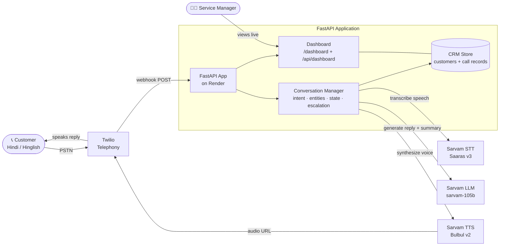

# AutoCare Motors — Multilingual Voice Bot for Auto Dealership Service

> A real-time, Hindi/Hinglish **voice bot** that answers a dealership's service line,
> books service appointments, checks recalls, handles complaints, escalates angry
> customers to a human, and logs an **AI-generated summary of every call** to a live
> dummy dashboard.
>

> case powered end-to-end by **Sarvam's STT + LLM + TTS** stack over live telephony.

---

## 🎬 Live Demo (start here)


| What | Where |
|------|-------|
| 📞 **Call the bot** | **+1 240 872 0864** (Twilio number — speak in Hindi or Hinglish) |
| 🖥️ **Live dashboard** | **https://sarvam-9mo2.onrender.com/dashboard** |
| ❤️ **Health check** | https://sarvam-9mo2.onrender.com/ |
| 💻 **Code** | https://github.com/suddh123-ship-it/sarvam |

> ⚠️ Hosted on Render's free tier — it sleeps after ~15 min idle, so the **first
> call/page load after inactivity takes 30–60s to wake up**. Just wait it out.

See the **[Demo Runbook](#-demo-runbook)** below for a step-by-step walkthrough.

### 📚 Documentation
- **[Business write-up](docs/business-writeup.md)** — problem, why AI, why Sarvam, ROI, and a 90-day rollout plan (customer-ready).
- **[Architecture diagram](docs/architecture.svg)** — full system diagram with all components, APIs, and data flows.
- **[Deployment guide](DEPLOY_RENDER.md)** — Render deployment steps.

---

## 🏢 The Enterprise Problem

Indian auto dealerships (Maruti, Tata, Mahindra, Hyundai…) run high-volume service
desks that are overwhelmed with repetitive inbound calls: *"book my car service",*
*"is there a recall on my model?",* *"reschedule my slot".* These calls are:

- **Repetitive & Tier-1** — 60–70% follow the same 3–4 intents.
- **Multilingual & code-mixed** — customers speak Hindi, English, and Hinglish
  interchangeably ("*morning slot chahiye, not evening*").
- **Costly** — human agents handle each call at high per-minute cost, with long
  hold times during peak hours.

A **voice bot that natively understands Indian languages and Hinglish** can absorb
the Tier-1 load, book appointments 24/7, and hand off only the complex/angry cases
to humans — while giving managers a **searchable log of every conversation**.

---

## 🧩 Architecture



> 📐 A standalone, presentation-ready system diagram is at
> [`docs/architecture.svg`](docs/architecture.svg).

### Call flow (per turn)

1. Customer calls the Twilio number → Twilio POSTs to **`/voice/inbound`**.
2. Bot greets in Hindi and gathers speech; each turn POSTs to **`/voice/gather`**.
3. Speech → **Sarvam STT (Saaras v3)** → text.
4. Text + conversation history → **Sarvam LLM (sarvam-105b)** → context-aware reply
   (with intent detection, entity extraction, and escalation logic layered on top).
5. Reply → **Sarvam TTS (Bulbul v2)** → natural Hindi audio, played back to caller.
6. On hang-up/escalation → LLM writes a **call summary**; the caller is matched to a
   CRM record by phone number and their **status is updated** (`call_completed` /
   `escalated`). Everything appears live on the **dashboard**.

### Components

| Component | File | Responsibility |
|-----------|------|----------------|
| **API / webhooks** | [`app/main.py`](app/main.py) | Twilio voice webhooks, audio serving, dashboard routes |
| **Sarvam client** | [`app/services/sarvam.py`](app/services/sarvam.py) | STT, TTS, and LLM chat-completion calls |
| **Conversation brain** | [`app/services/conversation.py`](app/services/conversation.py) | Intent detection, entity extraction, session memory, escalation, call summarization |
| **Telephony** | [`app/services/twilio.py`](app/services/twilio.py) | TwiML generation, outbound calls |

| **Dashboard UI** | [`app/dashboard.py`](app/dashboard.py) | Self-contained HTML dashboard (polls the JSON API) |
| **Config** | [`app/config.py`](app/config.py) | Env-based settings (Pydantic) |

---

## 🔊 Which Sarvam APIs Are Used — and Why


| Sarvam API | Model | Where | Why it's used |
|------------|-------|-------|---------------|
| **Speech-to-Text** | **Saaras v3** (`saaras:v3`) | [`sarvam.py › speech_to_text()`](app/services/sarvam.py) | Transcribes the caller's Hindi/Hinglish speech. Saaras is built for Indian languages + code-mixing, which generic STT handles poorly. Runs in `unknown`-language mode so it auto-detects. |
| **LLM / Chat** | **sarvam-105b** | [`sarvam.py › chat_completion()`](app/services/sarvam.py) | Generates the dealership agent's replies **and** the post-call summaries. An India-tuned LLM produces natural Hinglish responses with the right cultural tone ("ji", "aap"). |
| **Text-to-Speech** | **Bulbul v2** (`bulbul:v2`, voice `anushka`) | [`sarvam.py › text_to_speech()`](app/services/sarvam.py) | Speaks the reply back in a natural Indian voice. 

**Multilingual / code-mixing:** the bot handles **Hindi and English, mixed freely
(Hinglish)** — e.g. *"Kal 11 baje ka time fix karo, I have a meeting at 2."* This is
exactly the India-specific capability the assignment calls for, and it's driven by
Sarvam's models end-to-end.


---

## ✨ Features

- **Real-time voice loop** over live telephony (Twilio) — call a real phone number.
- **Hindi + Hinglish** understanding and speech (2+ languages, code-mixed).
- **Intent detection** — book service, check recall, get estimate, reschedule,
  cancel, complaint, general query.
-
- **Escalation to human** — angry/complex calls are detected and handed off.
- **AI call summaries** — every call is summarized by sarvam-105b.
-

---

## 🛠️ Local Setup

### Prerequisites
- Python **3.11** (see [`.python-version`](.python-version))
- A [Sarvam AI](https://dashboard.sarvam.ai/) API key
- A [Twilio](https://console.twilio.com) account + a voice-capable phone number


### Steps

```bash
# 1. Clone
git clone https://github.com/suddh123-ship-it/sarvam.git
cd sarvam

# 2. Create a virtualenv and install deps
python -m venv venv
venv\Scripts\activate          # Windows
# source venv/bin/activate     # macOS/Linux
pip install -r requirements.txt

# 3. Configure secrets
cp .env.example .env           # then edit .env with your real keys

# 4. Run
python run.py
```

The server starts on `http://localhost:8000`. Open
**http://localhost:8000/dashboard**.

### `.env` variables

See [`.env.example`](.env.example). Required:

| Variable | Purpose |
|----------|---------|
| `SARVAM_API_KEY` | Sarvam STT/TTS/LLM auth (`sk_...`) |
| `TWILIO_ACCOUNT_SID` | Twilio account SID (`AC...`) |
| `TWILIO_AUTH_TOKEN` | Twilio auth token |
| `TWILIO_PHONE_NUMBER` | Your Twilio number in E.164 (e.g. `+12408720864`) |
| `DEFAULT_LANGUAGE` | Default TTS/STT language (default `hi-IN`) |
| `DEBUG` | `true` locally (hot reload), `false` in production |

> 🔒 `.env` is **git-ignored** — secrets are never committed. In production they're
> set as environment variables in the Render dashboard.

### Connect Twilio (local)
1. Start a tunnel: `ngrok http 8000` → copy the `https://…ngrok…` URL.
2. Twilio Console → your number → **Voice Configuration**:
   - *A call comes in* → Webhook → `https://<ngrok>/voice/inbound` (HTTP POST)
   - *Call status changes* → `https://<ngrok>/voice/status` (HTTP POST)

---

## ☁️ Deployment (Render)

This project is deployed on Render — **no ngrok needed**, Twilio points straight at
the public Render URL. Full steps in **[DEPLOY_RENDER.md](DEPLOY_RENDER.md)**.

- Blueprint: [`render.yaml`](render.yaml) (secrets injected via the dashboard, never
  committed).
- Start command: `uvicorn app.main:app --host 0.0.0.0 --port $PORT`
- Twilio voice webhook → `https://<your-app>.onrender.com/voice/inbound`

---

## 📖 Demo Runbook

### Option A — Call the live bot (full experience)

1. **Open the dashboard** first so you can watch it update live:
   👉 **https://sarvam-9mo2.onrender.com/dashboard**
   You'll see 3 seeded customers (Rajesh Kumar, Priya Sharma, Amit Patel), all
   `ACTIVE`.
2. **Call the bot:** 📞 **+1 240 872 0864**
   *(Calling from **+91 95153 50276** matches you to customer "Rajesh Kumar", whose
   status will update after the call.)*
3. **Have a conversation in Hindi/Hinglish**, for example:
   - *"Namaste, meri car ki service karwani hai."*
   - *"Swift hai meri, 2022 model."*
   - *"Kal subah 10 baje ka slot chahiye, regular service aur oil change."*
   - *"Theek hai, kal 10 baje aaunga. Dhanyawad!"*
4. **Hang up.** Within a few seconds the dashboard shows:
   - The matched customer flips to **`CALL COMPLETED`** (or **`ESCALATED`** if you
     were angry / asked for a manager).
   - A new entry in **Recent Calls** with an **AI-generated summary** and extracted
     chips (vehicle, service, date, intent).

**Try the escalation path:** be irate — *"Ye teesri baar same problem aa rahi hai,
mujhe abhi manager se baat karni hai!"* — and watch the call end as `ESCALATED`.

> **Trial-account note:** if the Twilio account is on trial, you can only call
> from/to **verified numbers**, and Twilio plays a short trial message before the bot
> answers. Verify your number under Twilio Console → *Verified Caller IDs*.


---

## 📁 Project Structure

```
sarvam/
├── app/
│   ├── main.py              # FastAPI app: Twilio webhooks + dashboard routes
│   ├── config.py            # Env-based settings (Pydantic)
│   ├── dashboard.py         # Self-contained HTML dashboard
│   └── services/
│       ├── sarvam.py        # Sarvam STT / TTS / LLM client
│       ├── conversation.py  # Intent, entities, state, escalation, summaries
│       ├── twilio.py        # TwiML generation, outbound calls
│       └── crm.py           # In-memory customers + call records
├── tests/
│   └── test_conversation.py # Local conversation simulation (no phone needed)
├── render.yaml              # Render deployment blueprint
├── DEPLOY_RENDER.md         # Deployment guide
├── requirements.txt
├── .python-version          # Pins Python 3.11 for Render
└── .env.example             # Template for secrets
```


**Toward a 90-day enterprise rollout**
1. Real-time streaming STT/TTS (LiveKit + Sarvam) for sub-second latency.
2. Persistent datastore + DMS/CRM integration and calendar-based slot availability.
3. Post-call analytics pipeline (batch STT + diarization + LLM QA) using Sarvam's
   Call Analytics cookbook.
4. Human-in-the-loop warm transfer for escalations.
5. Observability, PII handling, and data-sovereignty controls (Sarvam's
   on-prem/India-hosted options are a key enterprise advantage).

---

## 🔗 References

- Sarvam API docs — https://docs.sarvam.ai/api-reference-docs/getting-started/welcome
- Sarvam dashboard — https://dashboard.sarvam.ai/
- Sarvam integrations — https://www.sarvam.ai/integrations
